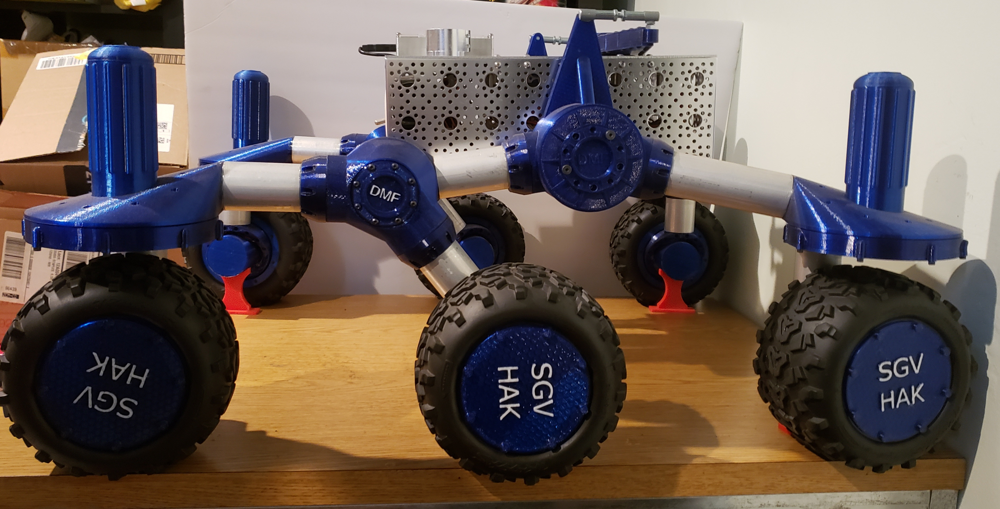
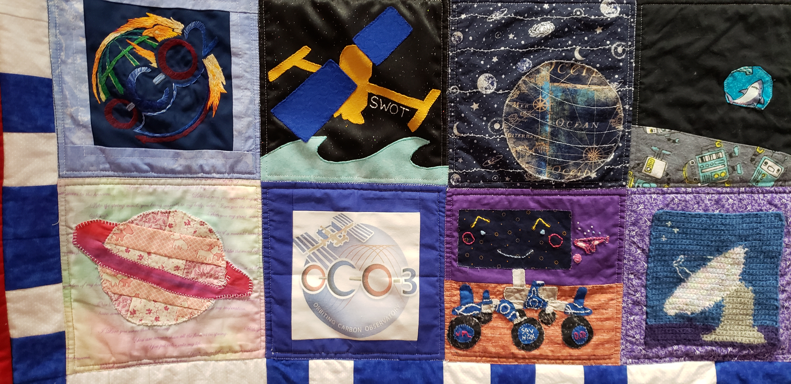
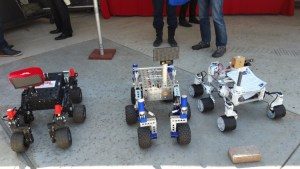

Currently using the following URL, until we figure out a domain name.  [http://bit.ly/sgvhak_rover](http://bit.ly/sgvhak_rover)

# March 2024
It's March 23rd.

We've had stop and go progress with the rover.  We've ordered the bulk of what we needed, but there are still parts on back order.  We have not started building yet as the team has been busy working on other projects.  And we are hopefully getting new team members for the SGVHAK Rover.

Lan is more heavily involved with the Open Source Rover maintainers this year.  Now that the redesign is public, we want to see people building the rovers and adding their builds to the [builders' gallery](https://open-source-rover.readthedocs.io/en/latest/examples/index.html#Instructions-for-adding-your-build).  

We are also hoping to get feedback on the documentation; it's new builders that point out the small inconsistencies and issues that the maintainers overlooked because they've been working on it for so long.

We attended the [Southern California Linux Expo (SCaLE 21x)](https://www.socallinuxexpo.org/scale/21x/), which had some great Open Source Rover content.  We will have a bunch of photos to share later.   

Achille, who leads the OSR maintainers, gave a fantastic talk to a packed room of over 100 people on [How to build a Mars Rover for Earth](https://www.socallinuxexpo.org/scale/21x/presentations/how-build-mars-rover-earth-nasa-jpl-open-source-rover).  It was the story of the Open Source Rover and how to grow an open source hardware community.  The video is missing some of the beginning and ending, but there's a lot of great content there, and the slides are available.

There were a number of rovers at the [The SCaLE Next Generation Playground](https://www.socallinuxexpo.org/scale/21x/events/scale-kids), which is the teen programming for SCaLE.  Santa Susana HS was there with a booth showing off the Open Source Rover they had built that semester. It was almost complete.  They fielded a bunch of questions about the project.   Achille lent his rover Raf, and so people were able to see and drive the rover.  And we had our SGVHAK rover there, so we could show the variation in what we can do with the rover platform, as well as the difference in design and look.

We are hoping for new influx of people who are interested in [The Open Source Rover](https://open-source-rover.readthedocs.io/en/latest/) and will join our [Open Source Rover Slack community](https://join.slack.com/t/opensourcerover/shared_invite/zt-mfe0viua-FhcYsNb3S9vUra99uF3IBw).

# October 2023
It's Oct 20th, and we're ready to start!  First, we'll start by ordering [all the parts](https://github.com/nasa-jpl/open-source-rover/tree/master/parts_list).  The goal is to get the bulk of the build done by the end of Thanksgiving weekend.  In the meantime, we'll set up some spaces for us to record our progress and lessons learned, and what our ambitions are once the build is complete.

We also now have a group email address, if you want to contact us: `sgvhakrover at gmail dot com`

# September 2023
After a long hiatus during the pandemic, we are happy to hear about the [OSR redesign](https://hackaday.com/2023/09/16/open-source-rover-gets-an-update-for-easier-building/) and will be looking forward to building another rover, as well as updating the documentation on this page.

In the meantime, the SGVHAK Rover hulked up sometime around 2020 and now looks like this.  

And it was immortalized in a [special quilt](https://www.pasadenaweekly.com/special_issues/engineers-by-day-quilters-by-night-pasadena-museum-of-history-exhibits-the-jpl-quilt/article_fbb888e2-0aea-11ee-853f-9fefd448fb5d.html).  

# March 2020
We just exhibited at the [Caltech Science for March](http://scienceformarch.sites.caltech.edu/) on March 16th, from 10am to 3pm.

We just presented our talk, ["The Trouble with Rovers"](https://www.socallinuxexpo.org/scale/17x/presentations/trouble-rovers) ([Slides](https://docs.google.com/presentation/d/1sczb-v-xm3jRvuGROQYNIzgqs63-SdqZXXZWUAy3kEY/present#slide=id.p)) at the [Southern California Linux Expo](https://www.socallinuxexpo.org/scale/17x) at the Pasadena Convention Center on March 9th.

# About 
[SGVHAK](http://www.sgvhak.org/) is a maker group based in the San Gabriel Valley.

The [JPL Open Source Rover](https://opensourcerover.jpl.nasa.gov/) is a relatively inexpensive and accessible project for high school and college classes to exercise mechanical and electronics and software engineering using parts that could be easily sourced from hobbyist stores. 

JPL beta-tested their build instructions at a few schools and with the SGVHAK maker group. The ultimate goal was to refine the build instructions and grow a community of experienced builders to help provide support once the rover documentation and code were open sourced.

The SGVHAK maker group built the rover over the period of 3 months, starting in January 2018, while giving JPL significant feedback and build photos.   The team mainly consisted of Lan Dang, Roger Cheng, David Flynn, John Wang, Emily Velasco, and Amy Baldwin.  We diverged from the original design most significantly in the wheel design, motor selection, and software. 

By March 2018, we were able to exhibit the SGVHAK rover at the [SCaLE 16x](https://www.socallinuxexpo.org/scale/16x), the [Caltech Science for March](http://www.caltech.edu/content/caltech-science-march).  In May, we were invited to the JPL IT Expo, a JPL internal event highlighting the latest trends in technology. In December, we exhibited at the [DTLA Mini Maker Faire](https://dtla.makerfaire.com/).  

We are speaking at [SCaLE 17x](https://www.socallinuxexpo.org/scale/17x) on March 9th at the Pasadena Convention Center.

We were interviewed by the [Command Line Heroes podcast](https://www.redhat.com/en/command-line-heroes).  You may hear some familiar voices on [season 2, episode 8 "Open Curiosity"](https://www.redhat.com/en/command-line-heroes/season-2/open-curiosity).
 

Below is the JPL Open Source Rover, the SGVHAK Rover, and Sawppy at the JPL IT Expo.

This is [a personal account](https://photos.app.goo.gl/r8BsmNv8qCP4MZig7) of our adventures at the DTLA Mini Maker Faire 2018, illustrated with photos and links.

 

# Future plans
Building rovers is a never-ending process.  The SGVHAK rover itself is always under construction.  We recently changed out the planetary gears, which were originally 60:1 with new 3D printed gears that are 21:1, so it now drives 3 times faster. We have plans to add a robot arm, pan-tilt webcam, and maybe even Lidar.  Roger wants to move to ROS. Our members have already started coming up with their own rover designs and builds.  All the code and 3D printer files are on GitHub.  

We participate in the Open Source Rover community, which started having monthly video teleconferences for the builders.  Our first call on March 6, 2019, was a huge hit.

# Website and documentation
This is currently under construction.  A great deal of documentation and photos and videos are in Google Drive or on Lan's phone and computer and needs to be cleaned up.  

Roger Cheng was our best documentarian and has a lot of info and photos in his build log and forum description.

# SGVHAK links
* Forum description of our build with links: [https://www.tapatalk.com/groups/jpl_opensource_rover/sgvhak-rover-t6.html](https://www.tapatalk.com/groups/jpl_opensource_rover/sgvhak-rover-t6.html)
* Roger's build log: [https://newscrewdriver.com/category/projects/sgvhak-rover/](https://newscrewdriver.com/category/projects/sgvhak-rover/)
* Dave's wheel design: [https://github.com/DavidMFlynn/RoverWheel](https://github.com/DavidMFlynn/RoverWheel)
* Roger's software: [https://github.com/Roger-random/SGVHAK_Rover](https://github.com/Roger-random/SGVHAK_Rover)
* Sawppy, a $500 rover inspired by the JPL Open Source Rover: [https://hackaday.io/project/158208-sawppy-the-rover](https://hackaday.io/project/158208-sawppy-the-rover)

# JPL Open Source Rover Links
* Landing Page: [https://opensourcerover.jpl.nasa.gov/](https://opensourcerover.jpl.nasa.gov/)
* GitHub: [https://github.com/nasa-jpl/open-source-rover](https://github.com/nasa-jpl/open-source-rover)
* Community Forum: [https://www.tapatalk.com/groups/jpl_opensource_rover/](https://www.tapatalk.com/groups/jpl_opensource_rover/)

# Timeline
For posterity, here is a timeline of events, to the best of our memory.

* Dec 2017 - Joined JPL Open Source Rover beta build group
* Jan 4, 2018 - JPL reference documentation available
* Jan 5, 2018 - Started buying parts
* Jan 29, 2018 - testing wheel assembly, beginning of software interface
* Feb 15, 2018 - Toured JPL, saw Curiosity engineering model, met JPL OSR and talked shop
* March 10, 2018 - SGVHAK Rover and JPL OSR exhibit at SCALE The Next Generation Playground
* March 31, 2018 - SGVHAK Rover exhibits at Caltech Science for March
* May 8, 2018 - SGVHAK Rover and Sawppy invited to JPL IT Expo
* Jul 31, 2018 - JPL formally announces JPL Open Source Rover
* Oct 2018 - upgrade planetary gears to speed up SGVHAK rover
* Oct 22, 2018 - visited by Command Line Heroes audio producer to get soundbites from SGVHAK rover build session
* Dec 1, 2018 - DTLA Mini Maker Faire - faster rover
* Dec 18, 2018 - Command Line Heroes podcast is live.  Listen for us at 3:13 to 3:58 and 24:47 to 25:16
* Feb 9, 2019 - Santa Susana STEAM Expo - new magnetic hubcaps
* Feb 20, 2019 - SGVHAK Rover borrowed for JPL outreach event at Logan McBride HS in Long Beach
* Mar 9, 2019 - "Trouble with Rovers" talk at SCALE 17x - new LED face
* Mar 16, 2019 - Caltech Science for March, with Santa Susana HS

